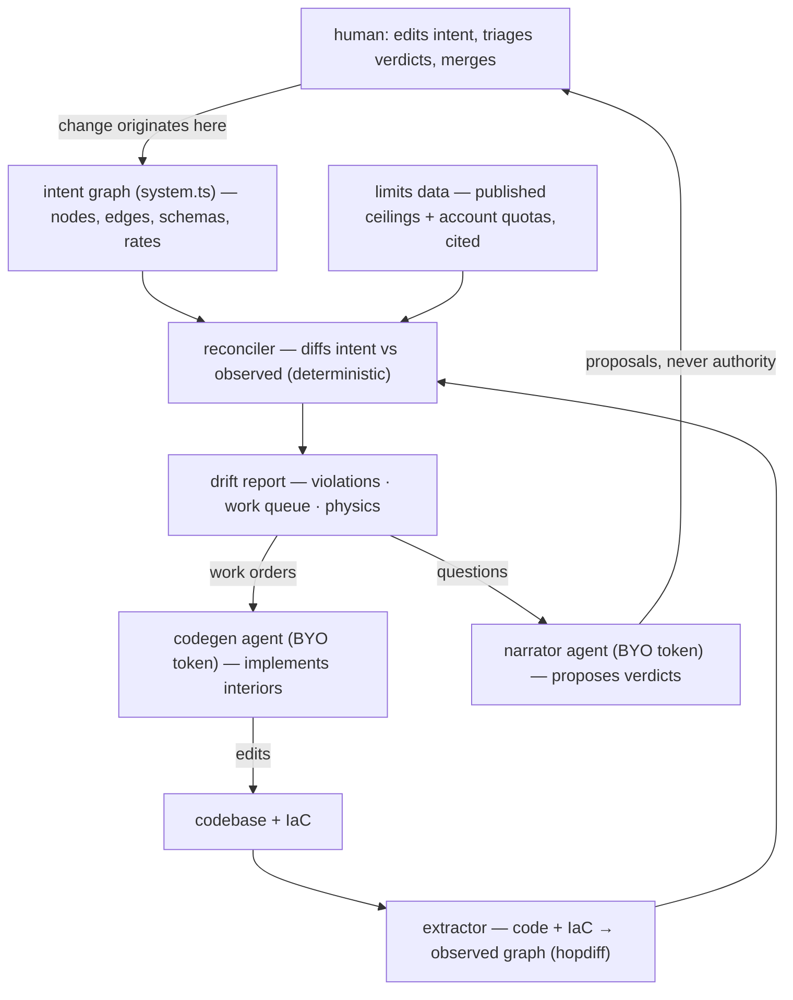

# hopdiff design — from observed hops to intended hops

*2026-07-05. Companion to the essay ["Hop Engineering"](https://medium.com/@emeline.liu/hop-engineering-30810c8615e3). hopdiff today
is the observation half of the system described here; this document is the design record
for the rest.*

## The problem

The most common failure mode in enterprise engineering is at the edges — service
boundaries and contracts. A syntactically and logically correct change ships, and the
consequence lands several call hops away, in a service nobody touched, because the
knowledge of how hops compose lives in tribal memory and outdated diagrams rather than
in any artifact a human, a CI gate, or a coding agent can check.

hopdiff currently answers *what are my hops* (observed, from code). The layers below
make it answer *what should they be* (declared) and *where do they disagree* (drift).

## The loop

Division of labor, which is also the trust model: **facts come from deterministic code**
(extractor, differ, limits lookup — no model anywhere in the middle), **drafts come from
agents** (code, verdict proposals — always re-observed or human-reviewed before becoming
state), **decisions come from humans** (intent edits, drift verdicts, merges). Agents
touch everything and decide nothing.

## The mechanisms

**Intent notation.** Desired state as a declared graph — services, channels (queues,
topics, tables), edges with schemas and expected rates. Same internal representation as
the extracted graph, so reconciliation is the existing differ pointed at a new pair of
inputs. Intent declares *boundaries only*: interiors of services are deliberately out of
scope, unspecified, and free.

**The code + IaC join.** A producer's code addresses a queue through an env var; the
consumer's binding lives in a CDK stack; no string is shared between the two codebases.
The edge exists only at the infrastructure layer, which is why text search cannot find
it. The extractor parses both sides and joins them, and every cross-service edge carries
its **witnesses** — the function-call paths that terminate at the client call, with
file:line receipts.

**Asymmetric drift.** The two directions of disagreement mean different things:
an edge in code but not in intent is a **violation** (undeclared dependency — fails the
build); an edge in intent but not in code is the **work queue** (a to-do list an agent
can execute — does not fail the build); an edge in both with contradicting contracts is
**drift** to triage. The drift report is deliberately written as an executable work
order: it is the prompt.

**Confidence, always attached.** Every reported edge and every drift claim carries how
it is known — resolved uniquely / heuristic guess / model-predicted — so humans and
agents know which claims to trust. A graph that guesses must say so. (Shipped in hopdiff
today at the edge level; extends to intent and drift claims.)

**Physics checks.** Declared rates on edges are validated against published service
limits — a curated, cited dataset (value, unit, scope, hard/soft/configurable, source
URL, as-of date) plus the account's live quotas. Capacity bugs become diff-time findings
instead of pages: a fan-out that multiplies a declared rate past a queue's ceiling is
detectable before deploy, statically.

**Compatibility over time.** Production is never one commit; it is a mixture of commits.
Schema evolution across an edge (a new enum value, a changed field) is checked against
the consumers' actual tolerance — which is itself extractable from code (deserializer
configuration is part of the edge contract) — yielding deploy-order constraints
("consumer-first") derivable at diff time, with no knowledge of what is deployed where.

## Onboarding brownfield systems

Intent is bootstrapped by disagreement, not declared from scratch: write a hypothesis
intent, dry-run the reconciler read-only, and triage each drift — *my belief was stale*
(fix intent), *the system is lying* (fix code), or *acknowledged debt* (suppressed, with
an expiry). Converge toward zero, then flip the reconciler from warning to gate. The
first dry-run pays for itself before the loop ever runs: it is a list of things you
believe about your system that are not true.

## Status

- **Shipped**: observed call graph across six languages, cross-service via linked
  siblings, before/after diff, blast radius, per-edge confidence, MCP tools.
- **Runnable sketch**: the loop end to end at toy scale — [design/sketch](design/sketch)
  (`node reconcile.mjs` prints a drift report with all three categories, exit code 1).
- **Not started**: the real extractor↔IaC join, intent notation v1, limits dataset,
  compatibility checks.

Principles that constrain all of it: BYO token (no hosted inference); verification stays
deterministic (models draft, code checks, humans authorize); intent covers boundaries
only; every claim travels with its provenance.
